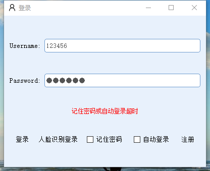

1.人脸识别，活体识别（张嘴，眨眼 ）  
2.人脸识别登录（登录失败三次后开启活体识别），注册，修改用户信息，退出登录，记住密码，自动登录  
3.批量用户导入数据库（将人脸向量特征序列化后存入sqlite3，dlib人脸特征向量为精度128位的浮点数，序列化后可能丢失精度，可使用专门的向量数据库库避免丢失精度。__后续使用orm替换裸写的sql语句，SQLAlchemy?SQLObject?Storm?peewee(用这个轻巧简洁)?pony(轻巧简洁)__ 
4.fps:10-15,cpu-i5-4210u,，gpu840m，编译测试过gpu加速，识别过程为少量计算，fps没有明显提高 
5.识别过程用了多进程并行，开始时识别速度慢（进程启动速度慢），考虑到登录速度问题人脸识别登录没有使用多进程，登录失败三次后进行活体识别,用qt重构多线程并行，效果估计很好 
6.ui框架为PySide6 
7.内存占用200-300m（主要是识别模型太大） 
8.人脸跟踪是耗时操作，去掉绘制框可提高fps。 
9.增加数据可视化功能 
10.识别成功时保存照片到用户文件夹 
11.浏览（浏览已有用户）、查看用户日志、查询用户功能，可修改，删除，查看用户图片(使用QGraphicsView，可移动，缩放) 
12.模型下载网址：dlib.net 
13.插件功能 
14.依赖 
dlib 19.8.1  python3.6(推荐使用miniconda管理版本)下可以直接pip安装dlib，__若使用其他python版本时需要自己编译dlib,dlib文件夹下有编译好的python3.9版本dlib，没有经过条件编译裁剪，功能多，貌似因此使用起来占用内存高？，推荐直接使用python3.6，pip直接安装使用__ 
lancedb                 0.2.2  
numpy                   1.15.4   
opencv-python           4.5.5.62   
psutil                  5.9.0   
PySide6                   5.15.6                
xlrd                    1.2.0   
Chart               5.15.5 
pycryptodome    3.16.0 
  
  
  
  
  
  
  
  

